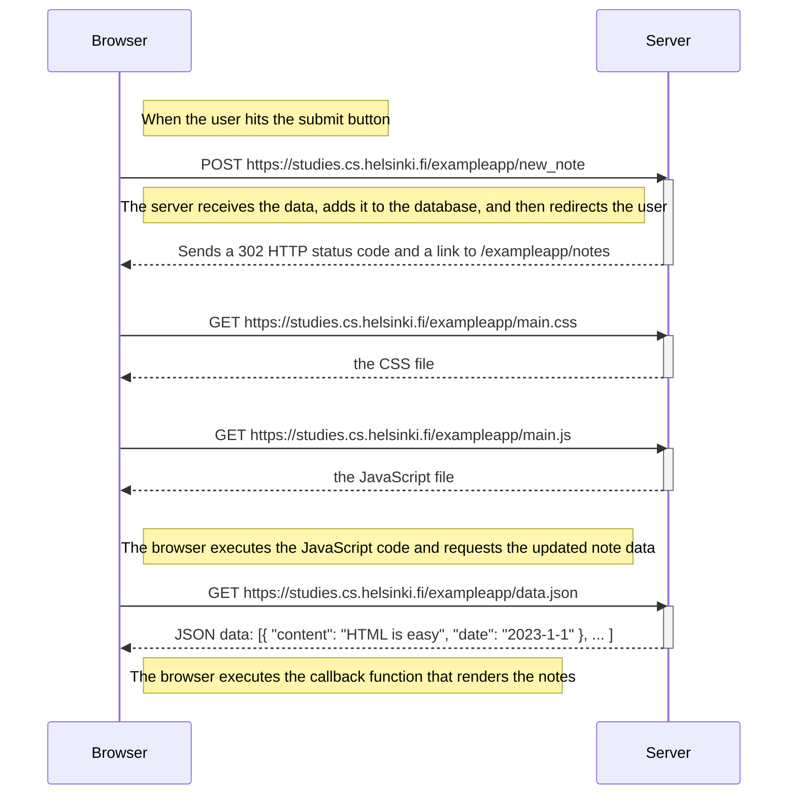

```mermaid
sequenceDiagram
    participant B as Browser
    participant S as Server

    rect rgba(255, 255, 255, 0.1)
        Note right of B: When the user hits the submit button

        B->>S: POST https://studies.cs.helsinki.fi/exampleapp/new_note
        activate S

        Note left of S: The server receives the data, adds it to the database, and then redirects the user

        S-->>B: Sends a 302 HTTP status code and a link to /exampleapp/notes
        deactivate S
    end

    rect rgba(255, 255, 255, 0.1)
        B->>S: GET https://studies.cs.helsinki.fi/exampleapp/main.css
        activate S

        S-->>B: the CSS file
        deactivate S
    end

    rect rgba(255, 255, 255, 0.1)
        B->>S: GET https://studies.cs.helsinki.fi/exampleapp/main.js
        activate S

        S-->>B: the JavaScript file
        deactivate S
    end

    rect rgba(255, 255, 255, 0.1)
        Note right of B: The browser executes the JavaScript code and requests the updated note data

        B->>S: GET https://studies.cs.helsinki.fi/exampleapp/data.json
        activate S

        S-->>B: JSON data: [{ "content": "HTML is easy", "date": "2023-1-1" }, ... ]
        deactivate S

        Note right of B: The browser executes the callback function that renders the notes
    end
```
