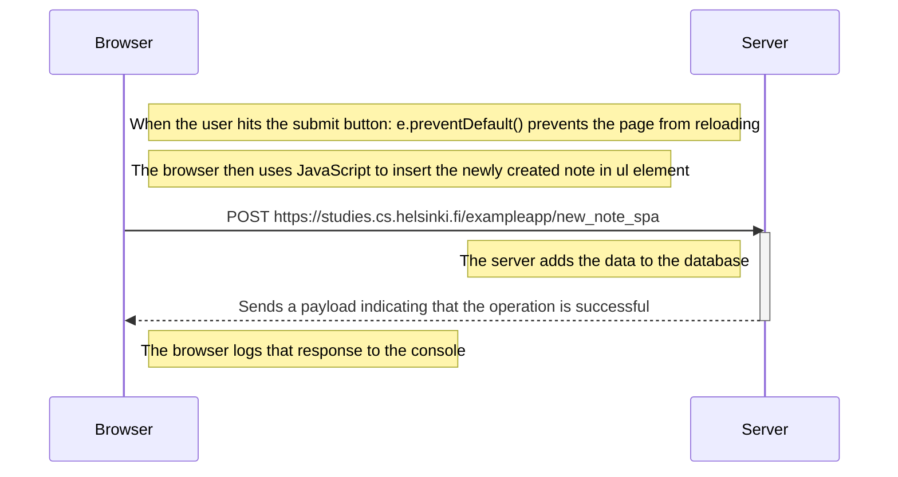

```mermaid
sequenceDiagram
    participant B as Browser
    participant S as Server

    rect rgba(255, 255, 255, 0.1)
        Note right of B: When the user hits the submit button: e.preventDefault() prevents the page from reloading

        Note right of B: The browser then uses JavaScript to insert the newly created note in ul element

        B->>S: POST https://studies.cs.helsinki.fi/exampleapp/new_note_spa
        activate S

        Note left of S: The server adds the data to the database

        S-->>B: Sends a payload indicating that the operation is successful
        deactivate S

        Note right of B: The browser logs that response to the console
    end
```
